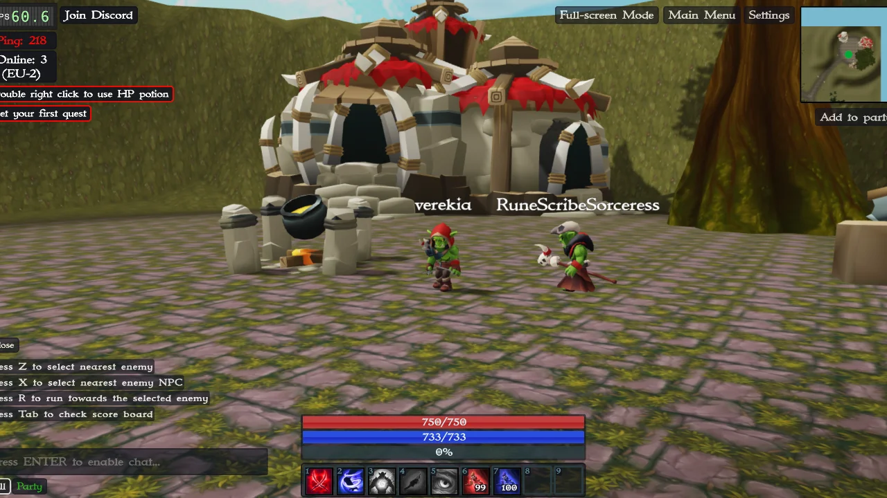

# Enion Online

## Overview

Enion Online is an Epic PvP Battle game between Orcs and Humans. It's a 3D browser-based multiplayer game that provides an immersive experience right within your favorite browser. The game is written using Clojure and ClojureScript, and utilizes the PlayCanvas game engine.




## Repository Structure

This repository contains two main directories:

- `enion-cljs`: This is the game client directory where all the client-side code resides.
- `enion-backend`: This directory hosts all the server-side code necessary for handling multiplayer and other backend functionalities.

## Getting Started

### Prerequisites

Before you can run Enion Online, you need to install the following:

- [Node.js and npm](https://nodejs.org/)
- [Leiningen](https://leiningen.org/)

### Setup and Run

#### Game Part

Navigate to the `enion-cljs` directory and install the necessary npm packages by running:

```bash
npm install
```

To start the game client, execute:

```bash
npm run watch
```

This will compile your ClojureScript code and start a development server. You can access the game client at:


[http://localhost:8280](http://localhost:8280)


#### Backend Part

To start the game backend, navigate to the `enion-backend` directory and execute:

```bash
lein run
```

This will start your Clojure server.

Now, your game is up and running!

## License

This project is licensed under the AGPL-3.0 License - see the [LICENSE.md](https://www.gnu.org/licenses/agpl-3.0.en.html) file for details. Please note, this project is not available for commercial purposes and is intended for personal use only.
